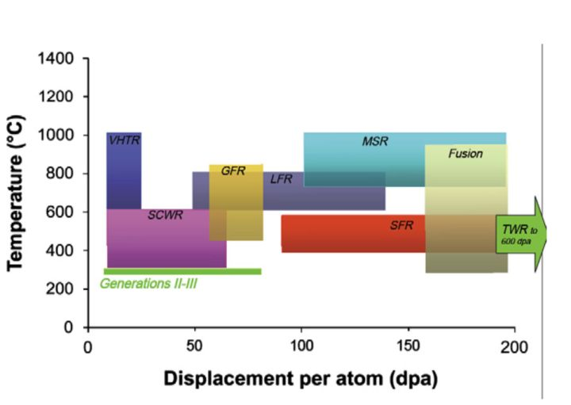
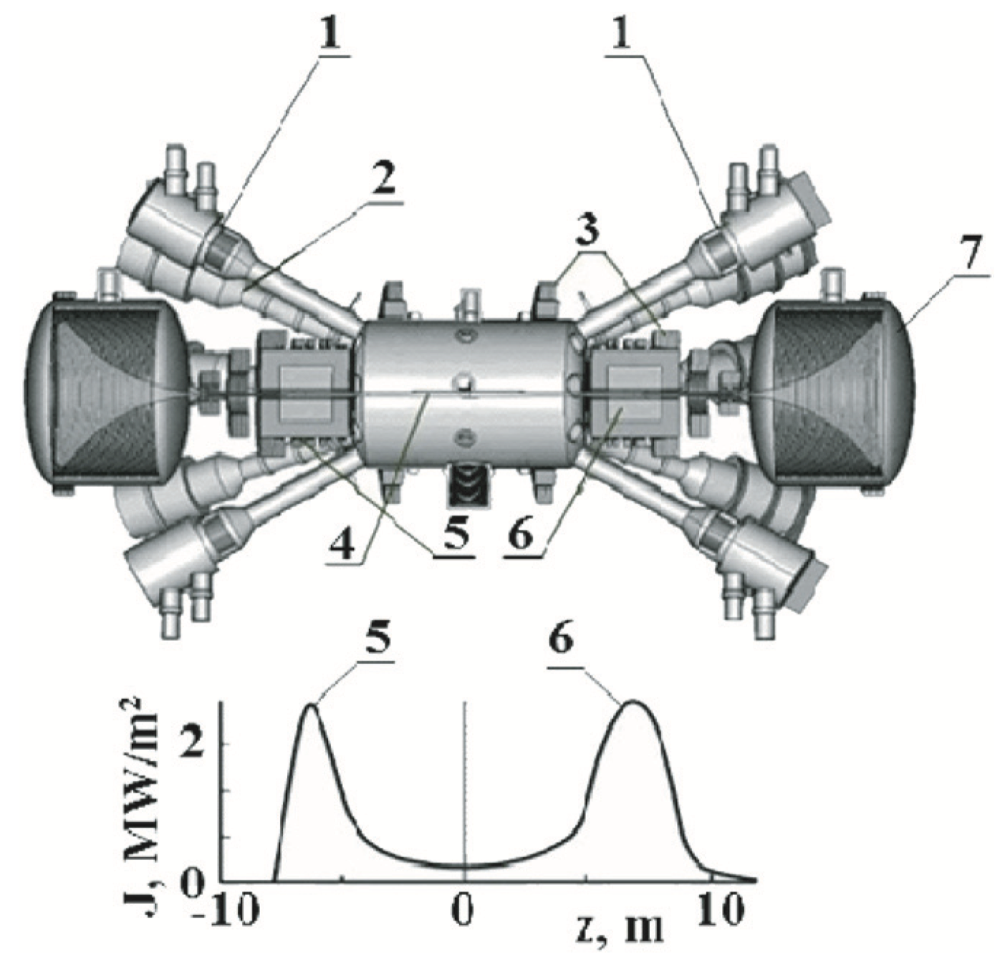

# 磁镜中子源

## 核材料的中子辐照损伤

在目前的核反应堆中，兆电子伏级的中子是普遍存在的核反应产物。这些高能中子若无法得到控制，将对反应堆的材料造成巨大的伤害。无论是在目前已经成熟的商用反应堆（Generation II-III），或是仍在进行可行性研究的四代堆（钠冷快堆SFR；熔盐快堆MSR；高温气冷堆VHTR；泰拉能源的行波堆TWR），以及大家孜孜以求的聚变堆。在这几个堆型中，中子辐照对反应堆结构材料造成的损伤可以用下图做概括。

横轴的Displacement per atom（dpa），中文各称为单位原子的位移量，用于衡量晶体中的原子位移损坏度，是核材料研究中量化辐照损伤的单位。我们可以看到，相比目前成熟的核能商用堆（Generation II-III），聚变堆（Fusion）中的结构材料需要承受更高的辐照损伤。盖茨的行波堆（TWR），更是超过聚变堆三倍之多，已经是超出了这个图的范围之外。

大剂量的辐照损伤会造成材料肿胀（void swelling）。目前商用堆常用的奥氏钢，在度过了最初的低肿胀区间后，材料将会进入快速肿胀区间。此时，每增加一个dpa，材料肿胀率将提高一个百分点。一般说来，工程部件不会允许有5%以上的体积变化。而区区增加5个dpa，就足以使材料肿胀体积超越5%。聚变堆的dpa值预计将是150到200。如果结构材料保持这个1%的肿胀趋势，后果将不堪设想。

除此以外，材料被辐照时的温度也会对中子造成的损伤有影响（见上图）。在相同的辐照损伤dpa下，取决于材料被辐照时的温度，材料性能下降的方式是完全不同的。Zinkle与Snead在2014年的综述文章中对这个问题的概括如下（Tm为材料熔点）[Zinkle, S. J., & Snead, L. L. (2014). Designing Radiation Resistance in Materials for Fusion Energy. Annual Review of Materials Research]
- 低温（< 0.3Tm)：材料失去延展性，失去strain hardening。
- 中温（0.2 - 0.55Tm)：肿胀（void swelling），相不稳定（phase instability），辐照加速的材料蠕变（irradiation-assisted creep）。
- 高温（> 0.5Tm)：氦气辅助下的材料脆化（He embrittlement)。He是D-T聚变反应产物。

换句话说，一种材料在低温下抗辐照性能良好，并不代表在高温下同样性能稳定。反之亦然。而由于聚变堆中同时存在极端的高温（等离子体热流）和低温（需要液氦冷却超导材料）。这对聚变堆材料的性能提出了比目前商用堆更广的“温度”要求，“温度”这个领域的问题就变得和辐照损伤剂量dpa同样重要。

目前，中子辐照理论是基于低辐照剂量的实验结果。100dpa及以上级别的中子辐照损伤还在研究阶段。并没有可靠的实验数据证明现在模型仍然适用于100dpa以上的情况。因此，大剂量的高能中子源对于聚变材料的研究就显得极为重要。

## 磁镜中子源

目前的聚变堆设计依赖于氘-氚反应。该反应具有最大的核反应截面，却将持续产生14MeV高能中子。因此,在针对聚变堆材料的中子辐照实验中，我们希望有同等能量且大剂量的中子源。但如此高能量的中子在其它核实验中却难以获得。最直接的方法是直接使用核聚变反应来产生14MeV中子。但目前核聚变实验成本高昂，且壁材料在装置中不易更换，给材料测试增加困难。使用价格更为低廉、设计更为简单的装置势在必行。而磁镜装置就符合这些要求。

一般来说，磁镜装置做为材料中子辐照测试平台具有许多潜在的优势：
- 高比压值（比压为等离子体热能与磁能的比值），磁镜位型上该值可大于0.5，因此具有更高的磁场利用率
- 构造简单，便于装备和组装
- 不依赖于轴向等离子体电流，避免等离子体破裂
- 较低的等离子体热负荷
- 便于去除氦灰

下图就是一种以磁镜装置为基础的中子源设计图。

1. 中性束注入
2. 中性束收集器
3. 磁场线圈
4. 等离子体真空腔
5. 等离子体源端
6. 等离子体尾端
7. 扩散腔（用于减小等离子体热流密度）

正如上图中显示，中子流量密度主要集中在高能粒子的折回点（图中5和6）附近。除去这一狭小的区域，其它的壁材料并不会受到高负荷的中子辐照，也就便于装置进行长时间稳态运行，而免于频繁的材料更换和装置维护。

由于磁镜位型缺乏磁剪切，高比压等离子体对flute modes（平行波数为零）不稳定。该不稳定性容易触发湍流，从而增加高能粒子在径向上的损失，减少等离子体约束。但这些不稳定模式可以通过增加等离子体极向旋转来抑制，例如通过放置偏压电极来改变径向电场和ExB漂移流。当旋转频率高于不稳定性的线性增长率时，该不稳定性将得到抑制。

为了降低成本，我们希望该中子源的聚变输出能量与输入能量相当，即Q=1。对于磁镜位型而言，实现此目标的难度在于轴向电子输运过高，从而难以获得较高的电子温度。而过低的电子温度（Te<1keV）直接导致较高的电子-离子碰撞率，降低了对高能离子的约束和核反应几率。不过，近年来的实验结果表明，如果在装置上添加电子辅助加热设备，如电子回旋波，可以有效地提高电子温度到接近1keV，大大降低库仑碰撞率，从而提升Q值。
